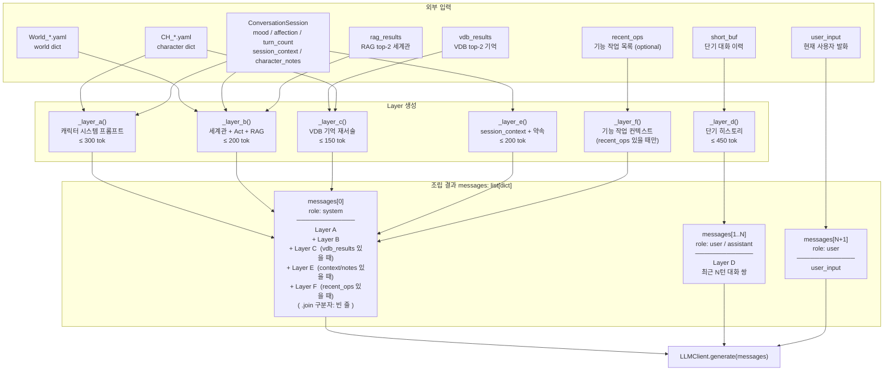
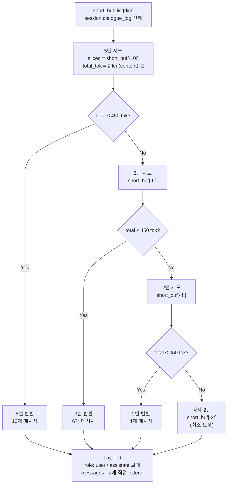
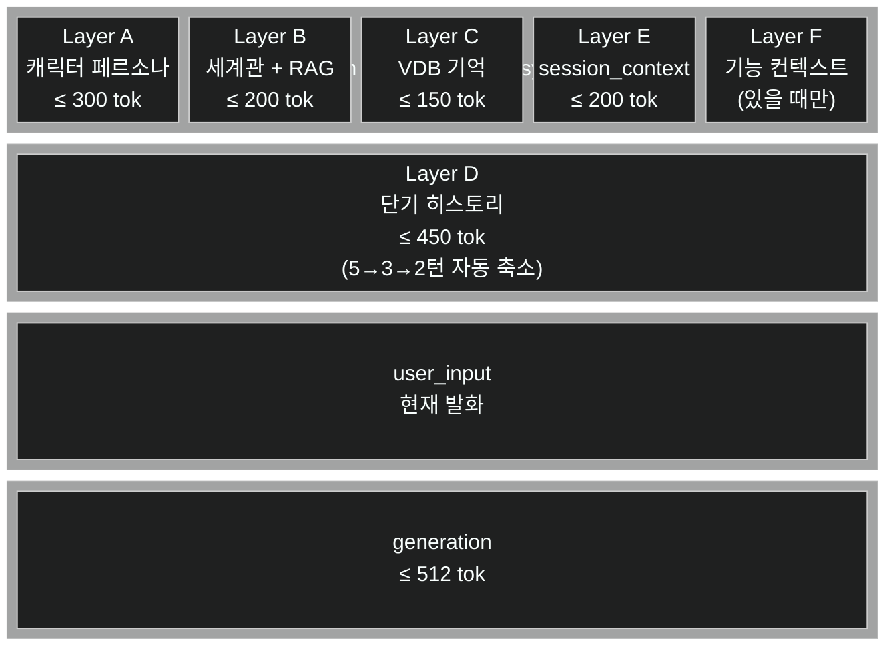
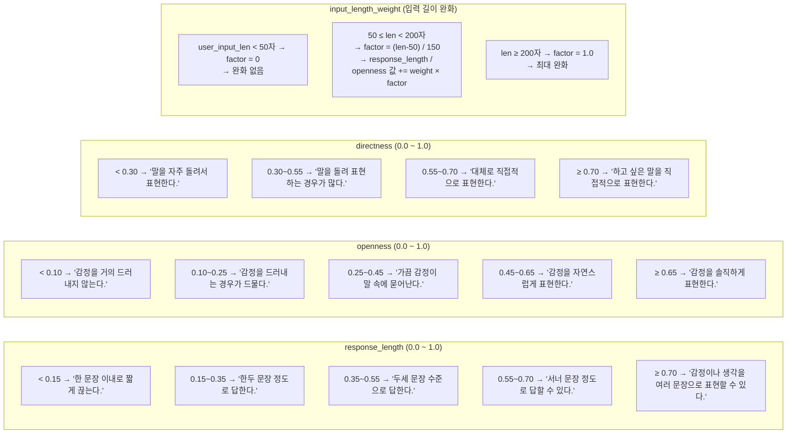

# Achat 프롬프트 빌딩 구조도

> `conversation/core/prompt_build.py` — `PromptBuilder.assemble()` 기준
> Mermaid 렌더링: GitHub / [Mermaid Live Editor](https://mermaid.live)

---

## 1. assemble() 전체 조립 흐름



---

## 2. Layer A — 캐릭터 시스템 프롬프트 상세

Layer A는 9개 블록을 순서대로 조립한 단일 문자열이다.

```mermaid
flowchart TD
    subgraph YAML["CH_*.yaml 슬롯"]
        Y1["name: 하루"]
        Y2["description:\n  본문 텍스트\n  예: 발화 예시 줄"]
        Y3["speech:\n  formality: 반말|존댓말\n  style: blunt|soft|직접 텍스트\n  persona: cool_observant|..."]
        Y4["personality:\n  calm|warm|energetic\n  cynical|tsundere|melancholic"]
        Y5["affection:\n  stranger: '...'\n  acquaintance: '...'\n  familiar: '...'\n  ..."]
        Y6["emotion:\n  happy: '...'\n  sad: '...'\n  annoyed: '...' ..."]
        Y7["conversation:\n  response_length: {tier: 0.0~1.0}\n  openness: {tier: 0.0~1.0}\n  directness: 0.0~1.0\n  input_length_weight: {...}"]
        Y8["rules:\n  - 규칙 문자열 목록"]
    end

    subgraph RUNTIME["런타임 상태"]
        R1["session.affection → _affection_tier()\n  0~100 값 → tier 문자열\n  (stranger/acquaintance/familiar\n   friendly/close/intimate)"]
        R2["session.mood\n  neutral|happy|sad|annoyed\n  curious|embarrassed|angry\n  affectionate|touched"]
        R3["user_input_len\n  50자 미만 → factor=0\n  200자 이상 → factor=1.0\n  → response_length / openness 완화"]
    end

    subgraph PRESETS["Preset 조회 테이블"]
        P1["_STYLE_PRESETS\nblunt → '말이 짧고 직접적'\nsoft  → '말투가 부드럽고 배려'"]
        P2["_PERSONA_PRESETS\ncool_observant / gentle_quiet\nquiet_sensitive / warm_dry"]
        P3["_PERSONALITY_PRESETS\ncalm / warm / energetic\ncynical / tsundere / melancholic"]
        P4["_AFFECTION_FALLBACK\nYAML affection 슬롯 없을 때 사용\nstranger~intimate 각 폴백 텍스트"]
        P5["_EMOTION_FALLBACK\nYAML emotion 슬롯 없을 때 사용\n8종 감정 폴백 텍스트"]
        P6["_BASE_RULES\n모든 캐릭터 강제 적용\n비한국어 문자 금지 등"]
    end

    subgraph OUTPUT_A["Layer A 출력 — 조립 순서"]
        O1["① 너는 {name}이다."]
        O2["② {description 본문}\n   [발화 패턴] 예: 줄 → 별도 블록"]
        O3["③ 반드시 반말로만 말한다. (formality)"]
        O4["④ style 지시문\n   YAML 직접 텍스트 OR preset 해석"]
        O5["⑤ persona 지시문\n   YAML 직접 텍스트 OR preset 해석"]
        O6["⑥ personality 지시문\n   YAML 직접 텍스트 OR preset 해석"]
        O7["⑦ affection tier 행동 지시문\n   YAML affection[tier] 우선\n   → 없으면 _AFFECTION_FALLBACK"]
        O8["⑧ emotion 상태 지시문\n   mood != neutral 일 때만 삽입\n   YAML emotion[mood] 우선\n   → 없으면 _EMOTION_FALLBACK"]
        O9["⑨ 대화 수위 지시문\n   response_length → 문장 수 지시\n   openness → 감정 표현 강도\n   directness → 직접성"]
        O10["⑩ [규칙]\n   _BASE_RULES + character rules"]
    end

    Y1 --> O1
    Y2 --> O2
    Y3 --> O3 & O4 & O5
    Y4 --> O6
    Y5 --> O7
    Y6 --> O8
    Y7 & R3 --> O9
    Y8 --> O10

    P1 --> O4
    P2 --> O5
    P3 --> O6
    P4 --> O7
    P5 --> O8
    P6 --> O10

    R1 --> O7 & O9
    R2 --> O8

    O1 & O2 & O3 & O4 & O5 & O6 & O7 & O8 & O9 & O10 -->|"\n".join()| RESULT["Layer A\n최종 텍스트 (~300 tok)"]
```

---

## 3. Layer B — 세계관 + Act + RAG

```mermaid
flowchart TD
    subgraph WORLD_YAML["World_*.yaml"]
        WD["description:\n  세계관 전반 설명"]
        SC["scenarios:\n  - scenario_id\n    acts:\n      - act_id\n        location\n        context"]
    end

    subgraph SESSION_STATE["세션 상태"]
        LOC["session.location_context\n동적 생성 장소 묘사\n(WorldNav가 설정)"]
        SID["session.scenario_id\nsession.act_id"]
    end

    subgraph RAG_RESULT["RAG 검색 결과"]
        RAG["WorldRetriever.query()\nSeaside.md → ChromaDB\ncosine 유사 청크 top-2"]
    end

    subgraph OUTPUT_B["Layer B 출력 — 조립 순서"]
        B1["[세계관]\n{world.description}"]
        B2_A["[현재 상황]\n{session.location_context}\n← 동적 장소 우선"]
        B2_B["[현재 상황 — {location}]\n{act.context}\n← YAML act 폴백"]
        B3["[세계관 배경 — 대화와 관련된 배경 정보]\n- {rag 청크 1}\n- {rag 청크 2}\n재가공 지시 포함"]
    end

    WD --> B1
    LOC -->|있으면| B2_A
    SC & SID -->|없으면| B2_B
    RAG -->|있을 때만| B3

    B1 & B2_A & B2_B & B3 -->|"\n\n".join()| RESULT_B["Layer B\n최종 텍스트 (~200 tok)"]
```

---

## 4. Layer C, E, F — 메모리 / 컨텍스트 레이어

```mermaid
flowchart LR
    subgraph LC_BOX["Layer C — VDB 기억"]
        LC_IN["vdb_results: list[str]\nlong_term.query() top-2"]
        LC_VOICE["character.memory_voice\n기억 서술 힌트 (있을 때만)"]
        LC_OUT["[어렴풋한 기억]\n- {기억 1}\n- {기억 2}\n(기억 표현 방식: {voice_hint})"]
        LC_IN & LC_VOICE --> LC_OUT
    end

    subgraph LE_BOX["Layer E — 세션 컨텍스트"]
        LE_IN1["session.session_context\nshort_term.evict_to_context()\n5턴 초과 발화 누적 텍스트"]
        LE_IN2["session.character_notes\n약속 패턴 감지 목록\n최근 10개만"]
        LE_OUT1["[이전 대화 요약]\n{session_context}"]
        LE_OUT2["[이번 세션 약속]\n- {약속1}\n- {약속2}"]
        LE_IN1 --> LE_OUT1
        LE_IN2 --> LE_OUT2
        LE_OUT1 & LE_OUT2 -->|"\n\n".join()| LE_OUT["Layer E 텍스트\n(둘 다 비면 → 빈 문자열 → 제외)"]
    end

    subgraph LF_BOX["Layer F — 기능 작업 (optional)"]
        LF_IN["recent_ops: list[str]\n최근 기능 모드 수행 목록\n최근 5개만"]
        LF_OUT["[방금 수행한 작업]\n- {작업1}\n- {작업2}\n인지 후 자연스럽게 대응 지시"]
        LF_IN --> LF_OUT
    end
```

---

## 5. Layer D — 단기 히스토리 (토큰 예산 관리)



---

## 6. 토큰 예산 전체 구조



> **총 컨텍스트 예산**: 300 + 200 + 150 + 200 + 450 + 512 = **약 1,800 tok**
> `n_ctx=4096` 기준으로 여유가 있어 Layer D 초과 시 강제 축소가 거의 발생하지 않는다.

---

## 7. conversation 파라미터 → 지시문 변환표 (_conv_hints)



---

## 8. 캐릭터 YAML 슬롯 → Layer A 매핑 요약

| YAML 슬롯 | Layer A 위치 | Preset 사용 여부 | 조건 |
|---|---|---|---|
| `name` | ① 이름 | - | 있으면 항상 |
| `description` | ② 설명 / 발화 패턴 | - | 있으면 항상. `예:` 줄은 `[발화 패턴]` 블록으로 분리 |
| `speech.formality` | ③ 말투 지시 | - | `반말` / `존댓말` 특수 처리. 그 외 직접 출력 |
| `speech.style` | ④ 스타일 | `_STYLE_PRESETS` | preset key면 해석, 아니면 직접 출력 |
| `speech.persona` | ⑤ 페르소나 | `_PERSONA_PRESETS` | 동상 |
| `personality` | ⑥ 성격 | `_PERSONALITY_PRESETS` | 동상 |
| `affection[tier]` | ⑦ 친밀도 행동 | `_AFFECTION_FALLBACK` | YAML 값 우선, 없으면 폴백 |
| `emotion[mood]` | ⑧ 감정 상태 | `_EMOTION_FALLBACK` | `mood != neutral` 일 때만 |
| `conversation.*` | ⑨ 대화 수위 | - | `_conv_hints()` 수치 → 자연어 변환 |
| `rules` | ⑩ 규칙 | - | `_BASE_RULES` 앞에 항상 선행 삽입 |
