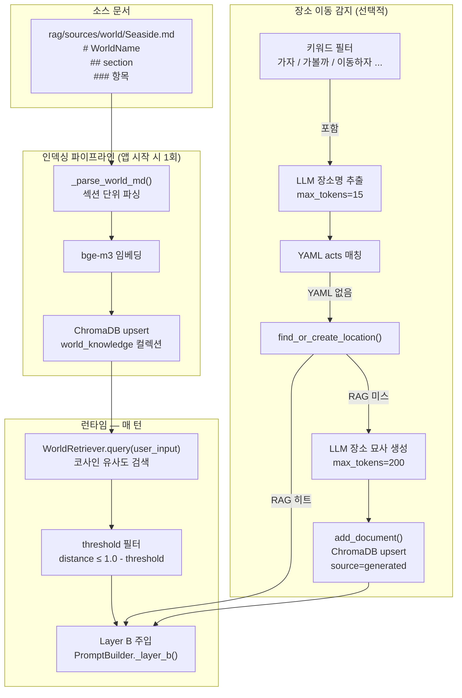
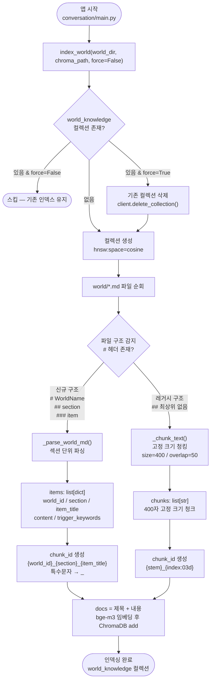
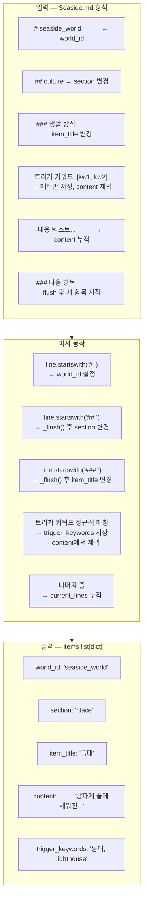
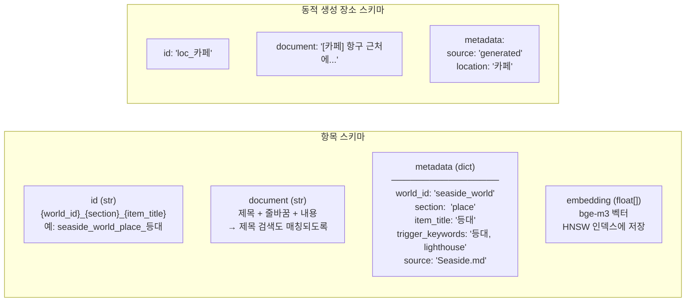
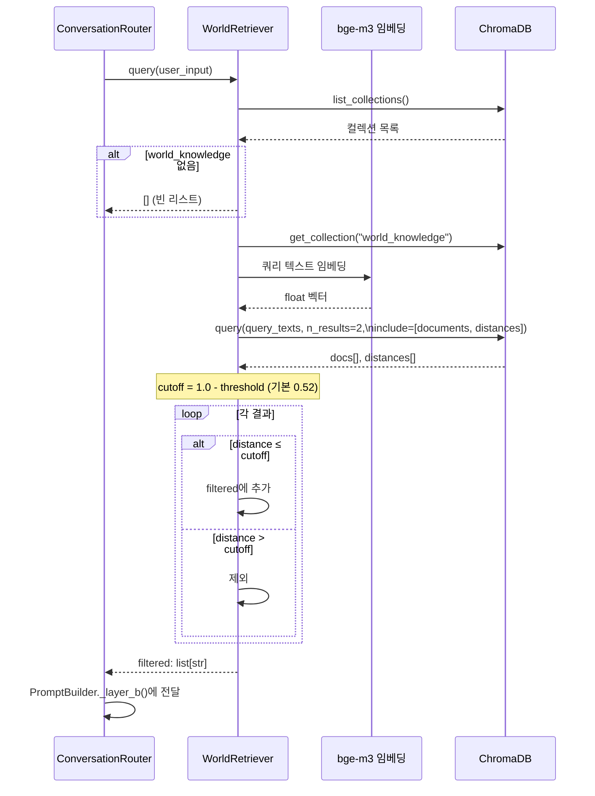
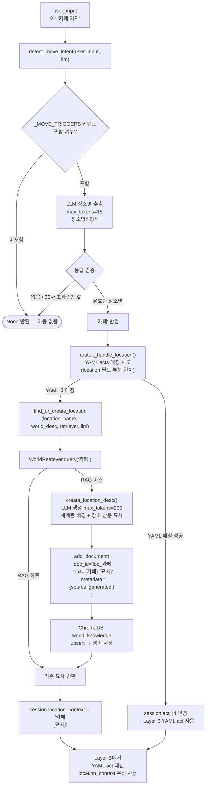
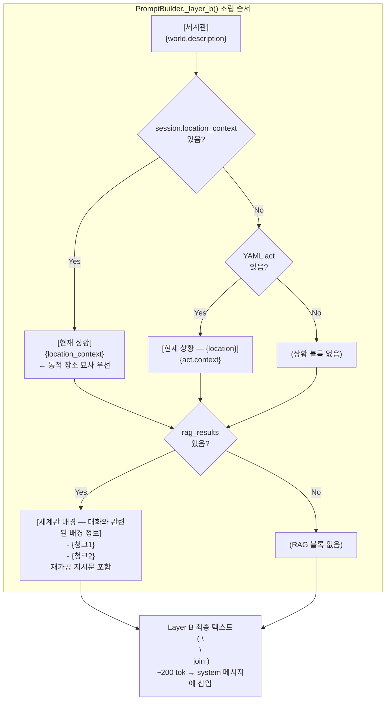
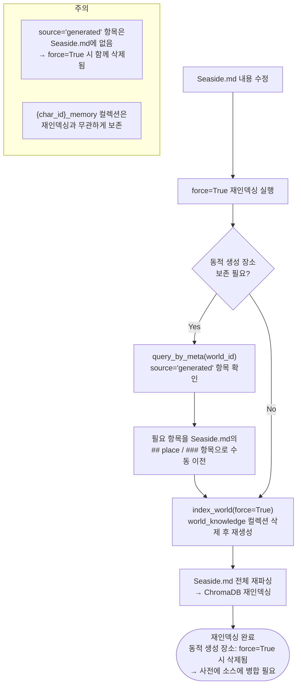

# Achat RAG 시스템 플로우차트

> `rag/index.py` · `rag/retrieve.py` · `rag/world_nav.py` 기준
> Mermaid 렌더링: GitHub / [Mermaid Live Editor](https://mermaid.live)

---

## 1. 전체 RAG 파이프라인 개요

---

## 2. 인덱싱 파이프라인 (`index_world`)

---

## 3. Seaside.md 구조 파서 (`_parse_world_md`)

---

## 4. ChromaDB 저장 스키마 (`world_knowledge` 컬렉션)

---

## 5. 매 턴 검색 플로우 (`WorldRetriever.query`)

---

## 6. 장소 이동 감지 및 동적 생성 (`world_nav`)

---

## 7. Layer B 내 RAG 결과 주입 방식

---

## 8. 재인덱싱 플로우 (소스 수정 후 반영)

---

## 9. RAG 관련 설정값 (`config.py`)

| 설정 키 | 기본값 | 설명 |
|---|---|---|
| `chroma_path` | `./chroma_deploy` | ChromaDB 저장 경로 |
| `embedding_model` | `BAAI/bge-m3` | 임베딩 모델 |
| `embedding_device` | `cpu` | 임베딩 연산 디바이스 |
| `rag_threshold` | → `vdb_threshold` 폴백 | RAG 검색 threshold (없으면 vdb_threshold 사용) |
| `vdb_threshold` | `0.52` | cosine 유사도 threshold (distance ≤ 1.0 - 0.52 = 0.48) |
| `vdb_top_k` | `2` | 검색 결과 최대 반환 수 |
