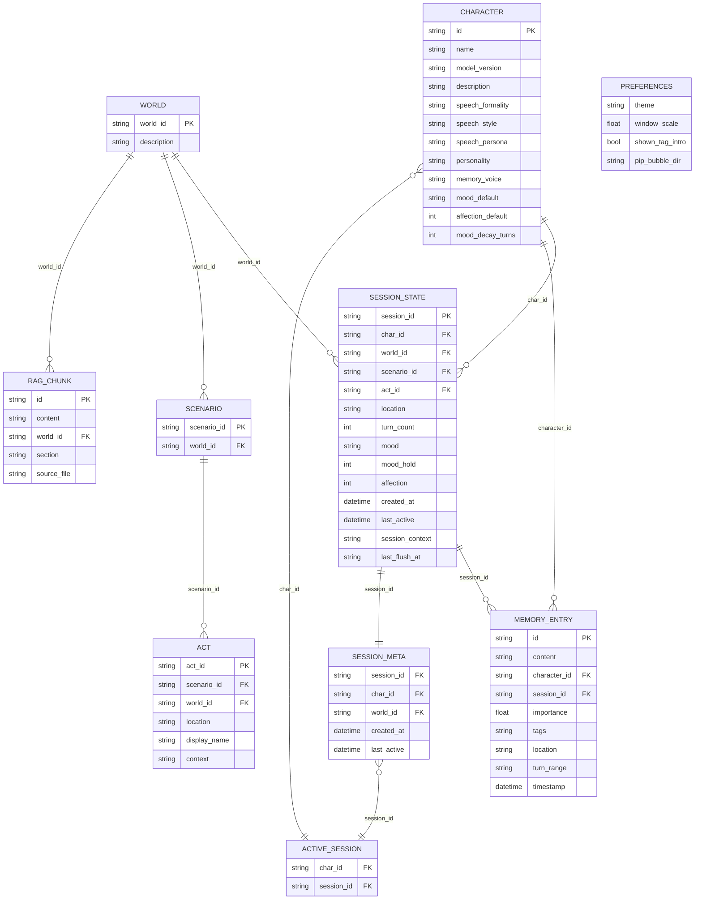

# Achat — 데이터 구조 및 ERD

> 이 문서는 ERD 이미지 생성 시 그대로 주문 가능한 수준으로 작성됐습니다.
> 각 엔티티의 필드, 타입, 제약, 관계를 모두 기재합니다.

---

## 엔티티 목록

| 엔티티 | 저장 위치 | 비고 |
|---|---|---|
| Character | `conversation/character/CH_*.yaml` | 정적 설정 파일 |
| World | `conversation/world/W_*.yaml` | 정적 설정 파일 |
| Scenario | World YAML 내 중첩 | World의 하위 구조 |
| Act | Scenario 내 중첩 | Scenario의 하위 구조 |
| SessionState | `data/sessions/{char_id}/{session_id}/state.json` | 런타임 영속 상태 |
| SessionMeta | `data/sessions/{char_id}/sessions.json` | 세션 인덱스 |
| ActiveSession | `data/sessions/active.json` | 현재 활성 세션 포인터 |
| MemoryEntry | ChromaDB — `{char_id}_memory` 컬렉션 | 장기 기억 VDB |
| RAGChunk | ChromaDB — `world_knowledge` 컬렉션 | 세계관 문서 청크 |
| Preferences | `ui_ux/assets/preferences.json` | 사용자 UI 설정 |

---

## 엔티티 상세

### Character

> 파일: `conversation/character/CH_*.yaml`
> 스키마: `conversation/character/character_schema.yaml`

| 필드 | 타입 | 필수 | 설명 |
|---|---|---|---|
| id | string | ✅ | PK. 파일명 기반 (`CH_Haru.yaml` → `Haru`) |
| name | string | ✅ | 표시 이름 (한글 가능) |
| model_version | string | | 학습에 사용된 LoRA 버전 |
| description | string | | 외형·성격 개요 (시스템 프롬프트에 삽입) |
| speech.formality | enum | ✅ | `반말` \| `존댓말` |
| speech.style | string | | preset: `blunt` \| `soft` \| 자유 기술 |
| speech.persona | string | | preset: `cool_observant` \| `gentle_quiet` \| `quiet_sensitive` \| `warm_dry` \| 자유 기술 |
| personality | string | | preset: `calm` \| `cynical` \| `tsundere` \| 자유 기술 |
| affection.stranger | string | | 친밀도 0~15 구간 행동 기술 |
| affection.acquaintance | string | | 친밀도 16~30 구간 행동 기술 |
| affection.familiar | string | | 친밀도 31~50 구간 행동 기술 |
| affection.friendly | string | | 친밀도 51~70 구간 행동 기술 |
| affection.close | string | | 친밀도 71~85 구간 행동 기술 |
| affection.intimate | string | | 친밀도 86~100 구간 행동 기술 |
| emotion.{mood} | string | | 각 감정 상태별 행동 기술 (8종) |
| rules | string[] | | 항상 지켜야 할 행동 제약 목록 |
| memory_voice | string | | VDB 기억 참조 시 말투 지침 |
| state.mood_default | enum | ✅ | 초기 mood 값 (기본: `neutral`) |
| state.affection_default | int | ✅ | 초기 친밀도 (기본: 30) |
| state.affection_thresholds | map | ✅ | tier → [min, max] 범위 매핑 |
| state.mood_decay_turns | int | | 감정 자연 복귀까지 유지 턴 수 (기본: 3) |
| state.mood_triggers | map | | mood 이름 → 트리거 키워드 목록 |
| state.affection_delta | map | | mood 이름 → 호감도 변화량 |
| state.trigger_events | map | | 특수 이벤트 (confession/betrayal 등) 정의 |
| conversation.response_length | map | | tier → 응답 길이 가중치 (0.0~1.0) |
| conversation.openness | map | | tier → 감정 개방도 가중치 (0.0~1.0) |
| conversation.directness | float | | 직접성 가중치 (0.0~1.0) |

---

### World

> 파일: `conversation/world/W_*.yaml`

| 필드 | 타입 | 필수 | 설명 |
|---|---|---|---|
| world_id | string | ✅ | PK |
| description | string | | 세계관 개요 |
| character_overrides.rules | string[] | | 이 세계관 안에서 캐릭터에 추가되는 규칙 |
| scenarios | Scenario[] | | 이 세계관의 시나리오 목록 |

---

### Scenario

> World YAML 내 `scenarios` 배열 항목

| 필드 | 타입 | 필수 | 설명 |
|---|---|---|---|
| scenario_id | string | ✅ | World 내 PK |
| acts | Act[] | ✅ | 이 시나리오의 Act 목록 |

---

### Act

> Scenario 내 `acts` 배열 항목

| 필드 | 타입 | 필수 | 설명 |
|---|---|---|---|
| act_id | string | ✅ | Scenario 내 PK |
| location | string | ✅ | 장소 식별자 (영문 소문자, RAG 검색 키) |
| display_name | string | ✅ | 화면 표시용 장소명 (한글) |
| context | string | ✅ | 현재 장소의 상황 묘사 (시스템 프롬프트 Layer B에 삽입) |

---

### SessionState

> 파일: `data/sessions/{char_id}/{session_id}/state.json`
> 클래스: `conversation/session_manager.py :: SessionState`

| 필드 | 타입 | 필수 | 설명 |
|---|---|---|---|
| session_id | string | ✅ | PK. UUID 형식 (`s_{date}_{uuid8}`) |
| char_id | string | ✅ | FK → Character.id |
| world_id | string \| null | | FK → World.world_id |
| scenario_id | string \| null | | FK → Scenario.scenario_id |
| act_id | string \| null | | FK → Act.act_id |
| location | string | | 현재 위치 식별자 |
| turn_count | int | ✅ | 누적 대화 턴 수 |
| mood | enum | ✅ | 현재 감정 상태 (8종 + neutral) |
| mood_hold | int | ✅ | 현재 mood 유지 남은 턴 수 |
| affection | int | ✅ | 현재 호감도 (0~100) |
| created_at | datetime | ✅ | ISO 8601 |
| last_active | datetime | ✅ | ISO 8601 |
| fired_stories | string[] | ✅ | 이 세션에서 이미 발동된 story 항목 제목 목록 |
| visited_places | string[] | ✅ | 방문한 장소 목록 |
| explained_cultures | string[] | ✅ | 설명된 culture 항목 목록 |
| session_context | string | | 중기 컨텍스트 스냅샷 (Z 레이어) |
| last_flush_at | datetime \| "" | | 마지막 대화 자동 정리 시각 |

**mood enum 값:** `neutral` `happy` `affectionate` `touched` `curious` `sad` `embarrassed` `annoyed` `angry`

---

### SessionMeta

> 파일: `data/sessions/{char_id}/sessions.json` — 배열 항목

| 필드 | 타입 | 필수 | 설명 |
|---|---|---|---|
| session_id | string | ✅ | FK → SessionState.session_id |
| char_id | string | ✅ | FK → Character.id |
| created_at | datetime | ✅ | ISO 8601 |
| last_active | datetime | ✅ | ISO 8601 |
| world_id | string \| null | | FK → World.world_id |

> 캐릭터당 최대 3개 유지 (`SessionManager.MAX_SESSIONS = 3`). 초과 시 가장 오래된 항목 자동 삭제.

---

### ActiveSession

> 파일: `data/sessions/active.json`

| 필드 | 타입 | 필수 | 설명 |
|---|---|---|---|
| char_id | string | ✅ | FK → Character.id |
| session_id | string | ✅ | FK → SessionState.session_id |

---

### MemoryEntry

> 저장소: ChromaDB PersistentClient — `{char_id}_memory` 컬렉션
> 스키마: `conversation/memory_act/M_schema.json`
> 임베딩 모델: `BAAI/bge-m3` (cosine space)

| 필드 | 위치 | 타입 | 필수 | 설명 |
|---|---|---|---|---|
| id | document | string | ✅ | PK. 형식: `mem_{char_id}_{seq}` |
| content | document | string | ✅ | 요약 기억 내용 (임베딩 대상) |
| metadata.character_id | metadata | string | ✅ | FK → Character.id. where 필터 기준 |
| metadata.session_id | metadata | string | | FK → SessionState.session_id |
| metadata.turn_range | metadata | string | | 요약 대상 턴 범위. 예: `"3-8"` |
| metadata.importance | metadata | float | ✅ | 중요도 0.0~1.0. 0.5 미만은 저장 안 함 |
| metadata.tags | metadata | string | | 핵심 키워드 (쉼표 구분 문자열로 직렬화) |
| metadata.location | metadata | string | | 대화 발생 장소 |
| metadata.timestamp | metadata | datetime | ✅ | ISO 8601 |

**중요도(importance) 등급:**

| 등급 | 범위 | 예시 |
|---|---|---|
| high | 0.8~1.0 | 사용자 이름, 약속·선언, 갈등·화해 |
| mid | 0.5~0.8 | 감정 사건, 취향·선호도, 반복 화제 |
| low | 0.0~0.5 | 일상 잡담, 단순 응답 → **저장 안 함** |

**쿼리 설정:**

| 항목 | 값 |
|---|---|
| n_results | 2 |
| similarity_threshold | 0.7 (cosine distance < 0.3) |
| where 필터 | `importance >= 0.5` |
| TTL | score 0.65~0.90 항목은 30일 후 만료 |
| 컬렉션당 최대 항목 | 200개 |

---

### RAGChunk

> 저장소: ChromaDB PersistentClient — `world_knowledge` 컬렉션
> 소스: `rag/sources/world/*.md`
> 임베딩 모델: `BAAI/bge-m3` (cosine space)
> 청킹: 400자 / overlap 50자

| 필드 | 위치 | 타입 | 필수 | 설명 |
|---|---|---|---|---|
| id | document | string | ✅ | PK. 형식: `{world_id}_{section}_{seq}` |
| content | document | string | ✅ | 청킹된 세계관 텍스트 (임베딩 대상) |
| metadata.world_id | metadata | string | ✅ | FK → World.world_id |
| metadata.section | metadata | string | ✅ | `culture` \| `place` \| `story` |
| metadata.source_file | metadata | string | | 원본 .md 파일명 |

**쿼리 설정:**

| 항목 | 값 |
|---|---|
| n_results | 3 |
| similarity_threshold | 0.55 (cosine distance < 0.45) |
| 매 턴 실행 여부 | 매 턴 실행 (미달 시 빈 리스트 반환) |

---

### Preferences

> 파일: `ui_ux/assets/preferences.json`
> 런타임 생성 파일 (gitignore 처리)

| 필드 | 타입 | 기본값 | 설명 |
|---|---|---|---|
| theme | enum | `"ocean"` | `"ocean"` \| `"amber"` \| `"violet"` |
| window_scale | float | `1` | 창 크기 배율 |
| shown_tag_intro | bool | `false` | 기능 모드 최초 안내 팝업 표시 여부 |
| pip_bubble_dir | enum | `"random"` | PIP 말풍선 방향: `"random"` \| `"left"` \| `"right"` |

---

## 관계 다이어그램 (텍스트)

```
Character ──────────────────────────────────────────┐
  │ id (PK)                                          │
  │                                                  │
  │ 1:N (char_id)         1:N (character_id)         │
  ▼                       ▼                          │
SessionState ──────────── MemoryEntry                │
  │ session_id (PK)         id (PK)                  │
  │ char_id (FK)            character_id (FK)        │
  │ world_id (FK) ─────┐   session_id (FK)           │
  │ scenario_id (FK)   │   content                   │
  │ act_id (FK)        │   importance                │
  │ mood               │   timestamp                 │
  │ affection          │                             │
  │ turn_count         │                             │
  │                    │                             │
  │ 1:1 (index)        │   World ───────────────────┘
  ▼                    │     │ world_id (PK)
SessionMeta            │     │
  │ session_id (FK)    └────►│ 1:N (scenario_id)
  │ char_id (FK)             ▼
  │                     Scenario
  │ N:1 (포인터)          │ scenario_id (PK within World)
  ▼                     │ 1:N (act_id)
ActiveSession           ▼
  char_id (FK)         Act
  session_id (FK)        act_id
                         location
                         context

World ──────────────────────────────────────────────►
  │ world_id (PK)                                    │
  │ 1:N (world_id)                                   │
  ▼                                                  │
RAGChunk                                  (SessionState.world_id FK)
  id (PK)
  content
  section (culture / place / story)
  world_id (FK)
```

---

## 관계 정의 요약

| 관계 | 카디널리티 | 기준 필드 | 비고 |
|---|---|---|---|
| Character → SessionState | 1:N | `SessionState.char_id` | 캐릭터당 최대 3개 세션 |
| Character → MemoryEntry | 1:N | `MemoryEntry.metadata.character_id` | ChromaDB where 필터 |
| World → SessionState | 1:N (optional) | `SessionState.world_id` | null 허용 |
| World → Scenario | 1:N | YAML 중첩 | 파일 내 포함 구조 |
| Scenario → Act | 1:N | YAML 중첩 | 파일 내 포함 구조 |
| World → RAGChunk | 1:N | `RAGChunk.metadata.world_id` | ChromaDB 컬렉션 |
| SessionState → MemoryEntry | 1:N | `MemoryEntry.metadata.session_id` | 세션 필터링용 |
| SessionState → SessionMeta | 1:1 | `SessionMeta.session_id` | 인덱스 항목 |
| SessionMeta → ActiveSession | N:1 | `ActiveSession.session_id` | 단일 활성 포인터 |
| Character → ActiveSession | N:1 | `ActiveSession.char_id` | 단일 활성 포인터 |

---

## ERD 이미지 생성 주문서

아래 내용을 ERD 툴(dbdiagram.io, draw.io, Mermaid 등)에 그대로 전달하면 됩니다.

### Mermaid ERD


