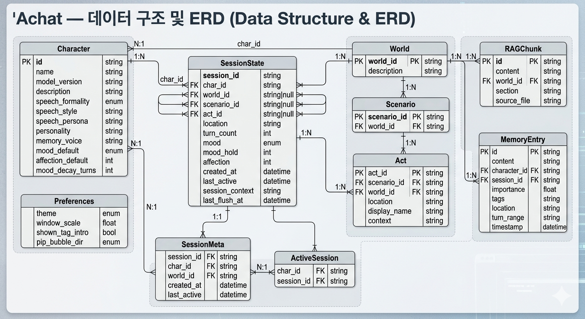

# Achat — 개발자 문서

> 플로팅 PIP 캐릭터 챗봇 + 기능 도우미  
> 한국어 특화 / Qwen2.5-3B 기반 / LoRA 파인튜닝 → GGUF 배포 파이프라인

---

## 목차

1. [프로젝트 개요](#1-프로젝트-개요)
2. [개발 환경 & 모델 선택](#2-개발-환경--모델-선택)
3. [시스템 아키텍처](#3-시스템-아키텍처)
4. [데이터 구조 (ERD)](#4-데이터-구조-erd)
5. [파이프라인](#5-파이프라인)
6. [기능 모드 도구](#6-기능-모드-도구)
7. [디렉토리 구조](#7-디렉토리-구조)
8. [로드맵](#8-로드맵)
9. [실현 가능성 검토](#9-실현-가능성-검토)
10. [환경 요구사항 & 설치](#10-환경-요구사항--설치)
11. [CI / CD](#11-ci--cd)
12. [알려진 제약 및 주의사항](#12-알려진-제약-및-주의사항)

---

## 1. 프로젝트 개요

다양한 가상 캐릭터와 자연스러운 대화를 나눌 수 있는 플로팅 PIP형 챗봇.

**두 가지 상위 모드:**
- **대화 모드** — 캐릭터 챗봇. 말투·감정(mood/affection) 상태 유지, 장기 기억.
- **기능 모드** — 파일 분류·변환·이름변경·검색·프롬프트 변환 도구. LLM은 자연어 → JSON 파라미터 추출만 담당, 실행은 rule-based Python.

> 대화 품질 설계 상세: [대화품질.md](참조/대화품질.md)  
> 학습 모델 후보 및 실험 설계: [학습후보.md](참조/학습후보.md)

---

## 2. 개발 환경 & 모델 선택

### 개발 환경 스펙

| 항목 | 사양 |
|---|---|
| GPU | RTX 5060 Ti (Blackwell / GB206) |
| VRAM | 8GB |
| 시스템 RAM | 8GB |
| OS | Linux |
| CUDA | 12.8+ 필요 (Blackwell 대응) |

### 모델 선택 근거

> **채택 모델: Qwen2.5-3B-Instruct** (1.5B는 폴백)

| 모델 | VRAM 추론 | QLoRA 학습 VRAM | LoRA 병합 CPU RAM | 판정 |
|---|---|---|---|---|
| Qwen2.5-7B | FP16 ~14GB | ~7-8GB (한계) | **~14GB ❌** | **불가** |
| **Qwen2.5-3B** | FP16 ~6GB | ~4-6GB ✅ | **~6GB ⚠️** | **채택** |
| Qwen2.5-1.5B | FP16 ~3GB | ~3-4GB ✅ | **~3GB ✅** | 폴백 |

**7B 탈락 이유:**
- LoRA 병합 단계에서 FP16 전체 모델을 CPU RAM에 올려야 함 → 14GB 필요
- 현재 시스템 RAM 8GB로는 물리적으로 불가

**3B 채택 이유:**
- QLoRA 학습: 4-bit 기반 모델(~2GB) + LoRA + 옵티마이저 합산 ~5GB → 8GB VRAM 내에서 동작
- LoRA 병합: ~6GB RAM 필요 → 8GB에서 타이트하지만 가능
- 캐릭터 챗봇 용도에서 파인튜닝 특화 시 3B로 충분한 품질 확보 가능

**1.5B 폴백 조건:**
- 병합 단계에서 OOM 발생 시
- 또는 RTX 5060 Ti + BitsAndBytes 호환 이슈가 지속될 경우

---

## 3. 시스템 아키텍처

### 대화 엔진 아키텍처

> 상세 설계는 [대화품질.md](참조/대화품질.md) 참조

```
User Input
    │
    ▼
[모드 분기]
    ├── 대화 모드 ──────────────────────────────────────────────┐
    │                                                            │
    │   [Pre-processing]  — 의도 분류, 엔티티 추출              │
    │       │                                                    │
    │       ├──────────────────────┐                            │
    │       ▼                      ▼                            │
    │   [단기 메모리]         [장기 메모리 VDB]                 │
    │    최근 5턴 + session_context  시맨틱 유사도 검색         │
    │    (검색 없이)            (bge-m3, 임계값 0.60)           │
    │       │                      │                            │
    │       └──────────┬───────────┘                            │
    │                  ▼                                         │
    │   [Context Assembly]  — 토큰 예산 관리                    │
    │     Layer A: 캐릭터 시스템 프롬프트 (고정, ~300 tok)      │
    │     Layer B: 세계관 + 현재 Act 상황  (고정, ~200 tok)     │
    │     Layer C: VDB 검색 결과           (동적, ~150 tok)     │
    │     Layer D: 단기 버퍼 최근 N턴      (동적, ~450 tok)     │
    │     Layer E: session_context + character_notes             │
    │     Layer F: 최근 기능 작업 요약 (있을 때만, ~50 tok)      │
    │                  │                                         │
    │                  ▼                                         │
    │            LLM (llama-cpp)                                 │
    │                  │                                         │
    │                  ▼                                         │
    │   [Post-processing]                                        │
    │     - mood / affection 상태 업데이트                      │
    │     - Act 전환 조건 체크                                   │
    │     - 메모리 쓰기 트리거 체크 (N턴 도달 또는 즉시 flush)  │
    │                  │                                         │
    │           N턴 조건 충족 시                                 │
    │                  ▼                                         │
    │   [Memory Write Pipeline]                                  │
    │     요약 → 중요도 scoring → 임베딩 → ChromaDB 저장        │
    │                                                            │
    └── 기능 모드 ──────────────────────────────────────────────┘

        [선택한 기능 전용 시스템 프롬프트로 LLM 교체]
        [대화 히스토리 / 장기 메모리 격리 — 기능 세션은 미기록]
            │
            ▼
        LLM (llama-cpp) — 자연어 → JSON 파라미터 추출
            │
            ▼
        [Rule-based 실행기] — 실제 작업 처리 (Python)
            │
            ▼
        결과 요약 → 사용자에게 응답
```

### 메모리 3계층 구조

| 계층 | 구현 | 지속 범위 | 용량 제한 |
|---|---|---|---|
| 단기 (short_term) | `session.dialogue_log` 슬라이딩 윈도우 | 최근 5턴 | ~450 tok |
| 중기 (session_context) | `evict_to_context()` 누적 텍스트 | 세션 내 전체 (최대 600자) | ~200 tok |
| 장기 (long_term) | ChromaDB VDB (bge-m3, cosine, dedup/quota/TTL) | 세션 간 영속 | 캐릭터당 최대 200개 항목 |

---

## 4. 데이터 구조 (ERD)

> 상세 필드 정의 및 관계: [ERD.md](참조/ERD.md)



**주요 엔티티:**

| 엔티티 | 설명 |
|---|---|
| **Character** | 캐릭터 YAML 스키마 — speech / affection / emotion / rules 슬롯 |
| **World / Scenario / Act** | 세계관 3계층 구조 (World → Scenario → Act) |
| **SessionState** | 런타임 대화 상태 (mood, affection, turn_count, dialogue_log) |
| **SessionMeta** | 세션 식별 정보 (character_id, world_id, session_id) |
| **ActiveSession** | 현재 활성 세션 포인터 |
| **MemoryEntry** | ChromaDB 장기 메모리 항목 (content, importance, tags, TTL) |
| **RAGChunk** | 세계관 문서 섹션 기반 청킹 + 임베딩 (world_knowledge 컬렉션) |
| **Preferences** | UI 환경설정 (테마, PIP 방향, shown_tag_intro 등) |

---

## 5. 파이프라인

### 학습 → 배포 전체 파이프라인

```
[개발 환경: Linux + RTX 5060 Ti (VRAM 8GB / RAM 8GB)]
        │
        ▼
  Qwen2.5-3B-Instruct (HuggingFace)
        │
        ▼
  LoRA 파인튜닝 (peft, bfloat16 풀 파라미터)
  - bfloat16 base + LoRA adapter (rank 32 / alpha 64)
  - BitsAndBytes 미사용 (Blackwell SM 10.x 미지원)
  - gradient_checkpointing=True, batch_size=1, grad_accum=8
  - max_seq_length=512 (한국어 토큰 밀도 고려)
  - assistant 토큰 마스킹 — system/user 구간은 loss 제외 (v7~)
  - 캐릭터 말투 / 감정 반응 / 한국어 일관성
  - 기능 모드용 자연어 → JSON 파라미터 추출 예시 포함
        │
        ▼
  LoRA 가중치 병합 (merge_and_unload, CPU 오프로드)
  ⚠️ RAM 약 6GB 사용 — 다른 프로세스 종료 후 실행 권장
        │
        ▼
  GGUF 변환 (llama.cpp convert_hf_to_gguf.py)
        │
        ▼
  Q4_K_M 양자화 (llama.cpp quantize)
  - 최종 파일 크기: 약 2GB
        │
  ───────────────────────────────────────
        │
[배포 환경: Windows + CPU]
        │
        ▼
  llama-cpp-python (CPU 추론)
  - 3B Q4_K_M 예상 속도: 8~15 tok/s
        │
        ▼
  PySide6 플로팅 UI (PIP 스타일)
  - Frameless / Always-on-top / 모서리 스냅
  - hover 투명도 전환 / 최소화 시 버블 축소
  - 대화 모드 ↔ 기능 모드 전환
```

---

## 6. 기능 모드 도구

각 도구는 대화 엔진에만 종속된 독립 마이크로서비스 형태.  
LLM은 자연어 해석 및 파라미터 추출만 담당, 실행은 rule-based Python.

### 폴더 정리

| 세부 기능 | 방식 |
|---|---|
| 파일 분류 | 확장자 / MIME 타입 기반 자동 분류, 분류 기준은 자연어로 지정 |
| 확장자 일괄 변환 | 이미지(jpg/png/webp/bmp), 문서(txt/md) — 외부 의존 없음. 영상/음성은 ffmpeg 선택 의존 |
| 이름 일괄 변환 | 패턴/규칙 자연어 지정 → LLM이 rename 규칙 파싱 → `pathlib` 실행 |

### 프롬프트 변환

사용자가 작성한 텍스트를 LLM 프롬프트 형태로 재구성 (명확하게 / 간결하게 / 상세하게 / 질문형 / 지시형 5종).  
기능 전용 시스템 프롬프트로 교체하여 대화 모드와 완전 분리.

### 로컬 파일 검색

| 종류 | 방식 |
|---|---|
| 로컬 검색 | SQLite FTS5 파일 인덱싱 (서브폴더 포함 os.walk, 권한 오류 자동 건너뜀) |

---

## 7. 디렉토리 구조

```
Achat/
│
├─ docs/                           # 프로젝트 문서
│   ├─ introduce.md               # 개발자 문서 (이 파일)
│   ├─ Achat_ERD.png              # ERD 이미지
│   ├─ ERD.md                     # ERD 상세 필드 정의 (→ docs/참조/ERD.md로 통합)
│   ├─ 로드맵.md                   # 개선 로드맵 (1~7단계)
│   ├─ VDB.md                     # ChromaDB 구조 및 운용 가이드
│   ├─ BUG/                       # 버그 추적 문서
│   ├─ plan/                      # 구현 계획서 (phases, deploy_checklist 등)
│   └─ 참조/                      # 기술 참조 (DIR, ERD, 포폴, 학습후보, 대화품질 등)
│
├─ conversation/                   # 대화 엔진 (핵심)
│   ├─ core/
│   │   ├─ llm_client.py          # llama-cpp-python 인터페이스
│   │   ├─ prompt_build.py        # Context Assembly + 토큰 예산
│   │   ├─ router.py              # 턴 처리 + Post-processing
│   │   └─ session.py             # 세션 상태 (mood, affection, turn_count)
│   ├─ loader/
│   │   ├─ character_load.py      # 캐릭터 YAML 로더
│   │   ├─ memory_load.py         # 메모리 로더
│   │   └─ world_load.py          # 세계관 로더
│   ├─ memory_act/                # 메모리 스키마 및 초기 데이터
│   ├─ character/                  # 캐릭터 설정 파일
│   │   ├─ character_schema.yaml   # 캐릭터 계약 (슬롯 = 학습 카테고리 어휘)
│   │   ├─ CH_Haru.yaml
│   │   ├─ CH_MookHyeon.yaml
│   │   └─ CH_default.yaml
│   ├─ world/                      # 세계관 설정 파일
│   │   ├─ W_schema.json
│   │   └─ W_sea.yaml
│   └─ main.py
│
├─ memory/                         # 메모리 관리 레이어
│   ├─ short_term.py              # 슬라이딩 윈도우 (최근 5턴) + evict_to_context()
│   ├─ long_term.py               # ChromaDB VDB 저장 / 검색 (dedup / quota / TTL)
│   └─ summarizer.py              # 요약 + 중요도 scoring + 쓰기 트리거
│
├─ narration/                      # 세계관 트리거 패키지
│   ├─ world_trigger.py           # story/place/culture 트리거 (절대 점수 ≥0.9, 토큰 부분 매칭)
│   └─ narration_monitor.py       # 키워드 하드코딩 나레이션 (세션 내 1회)
│
├─ rag/                            # RAG 파이프라인
│   ├─ index.py                   # 세계관 문서 섹션 기반 청킹 + ChromaDB 인덱싱
│   ├─ retrieve.py                # 시맨틱 유사도 검색 (bge-m3, rag_threshold 0.55)
│   ├─ world_nav.py               # 이동 의도 감지 + 동적 장소 생성
│   └─ sources/world/Seaside.md   # 통합 세계관 소스 (## culture / ## place / ## story)
│
├─ agent/                          # Agent 오케스트레이터
│   ├─ core.py                    # 전체 흐름 조율 + 모드 분기
│   ├─ persona.py                 # 캐릭터 YAML 로딩 + 핫스왑
│   ├─ state.py                   # mood / affection 상태 정의
│   └─ router.py                  # 시동어 / 명령어 분기
│
├─ ui_ux/                          # QML + PySide6 플로팅 UI/UX
│   ├─ bridge.py                  # ChatBridge(QObject) — QML↔Python 시그널/슬롯
│   ├─ chat_panel.py              # LLMWorker(QThread) — 백그라운드 LLM 추론
│   ├─ widget.py                  # UIEngine — QML 엔진 래퍼
│   ├─ tray.py                    # 시스템 트레이
│   ├─ qml/
│   │   ├─ Style.qml              # 디자인 토큰 singleton (색상/폰트/애니메이션)
│   │   ├─ main.qml               # 플로팅 윈도우 (버블 축소/확장, 드래그, 스냅)
│   │   ├─ ChatBubble.qml         # 재사용 말풍선 컴포넌트
│   │   ├─ PipWindow.qml          # PIP 마스코트 모드 (bubbleDirection: random/left/right)
│   │   ├─ SettingsPanel.qml      # 설정 패널 (테마/캐릭터/세계관/PIP 방향)
│   │   ├─ SideMenuPanel.qml      # 사이드 내비게이션 패널 (DB/설정/관리 아코디언)
│   │   ├─ MemoryDBPanel.qml      # ChromaDB 장기 메모리 + 세계관 CRUD 패널
│   │   ├─ AdminPanel.qml         # 관리자 패널 (affection 직접 조작)
│   │   ├─ CharacterCreatePanel.qml / CharacterBuildPanel.qml
│   │   ├─ EmotionPanel.qml       # 감정 오버레이 편집 패널
│   │   ├─ WorldCreatePanel.qml / WorldImagePanel.qml
│   │   ├─ CharacterDisplay.qml / CharacterSelectPanel.qml / CharacterStatusPanel.qml
│   │   ├─ ResetConfirmPanel.qml
│   │   ├─ FileOptionsPanel.qml / FolderClassifyPanel.qml / FileSearchPanel.qml
│   │   └─ ManualPanel.qml        # 기능 설명 패널
│   └─ assets/
│       ├─ icons/                 # 앱 아이콘 PNG
│       └─ characters/            # 캐릭터 PNG/GIF
│
├─ tools/                          # 기능 모드 — 도구 마이크로서비스
│   ├─ base.py                    # Tool 인터페이스 (파라미터 수신 → 실행 → 결과 반환)
│   ├─ folder/
│   │   ├─ classifier.py          # 파일 분류 (확장자 / MIME)
│   │   ├─ converter.py           # 확장자 일괄 변환
│   │   └─ renamer.py             # 이름 일괄 변환
│   ├─ prompt_converter.py        # 프롬프트 변환 (5종 스타일)
│   └─ search/local_search.py     # 로컬 파일 FTS5 검색
│
├─ training/                       # LoRA 파인튜닝
│   ├─ lora_train.py              # 학습 스크립트 (bfloat16, assistant 마스킹, EWCTrainer)
│   ├─ ewc.py                     # EWC Fisher 계산 CLI + EWCPenalty 클래스
│   ├─ train_monitor.py           # 학습 모니터링 래퍼 (과적합 감지 → 조기 종료 + VRAM 해제)
│   ├─ dataset.py                 # 데이터셋 로더 (ChatML, stratified sampling, category_weights)
│   ├─ eval/                      # 평가 스크립트
│   │   ├─ ai_tell_checker.py     # AI투 표현 패턴 측정 (학습 후 자동 실행)
│   │   ├─ memory_test.py         # 기억 유지 정확도 (5케이스)
│   │   ├─ scenario_eval.py       # 고정 18개 시나리오 자동 평가 (합격 15/18)
│   │   ├─ klue_regression.py     # KLUE 회귀 평가 (lm-eval 필요, 선택적)
│   │   ├─ speed_bench.py         # 추론 속도 벤치마크 (수동)
│   │   └─ verify_phases.py       # Phase 2/3 실환경 검증 (12턴)
│   ├─ data/                      # 학습 데이터 (3,983건, 71파일, v12 데이터 포함 / 채택 모델은 v11)
│   │   ├─ affection/             # 친밀도 6단계 (stranger~intimate) + formal/ 6단계
│   │   ├─ common/                # memory_ref / ai_tell_removal / world_context_use 등
│   │   ├─ emotion/               # 감정 상태별 (12종)
│   │   ├─ long_dialogue/         # 장대화 (9종)
│   │   ├─ memory/                # VDB 기억 활용 / 세션 참조 / 약속 패턴 / 요약 (4종)
│   │   ├─ personality/           # 6종 성격별
│   │   └─ speech_style/          # 말투 조합 (formal / informal / persona)
│   ├─ scripts/
│   │   ├─ build_sft_from_feedback.py  # feedback_pos → ChatML SFT 변환
│   │   └─ rewrite_system_prompts.py   # 학습 데이터 시스템 프롬프트 재작성
│   └─ log/                       # 대화 로그 수집 (.gitignore — daily/emotion/feedback 등)
│
├─ output/                         # LoRA 어댑터 출력 (.gitignore 처리)
│   ├─ LoRA_v9/adapter/           # EWC λ=500, eval best 1.511
│   ├─ LoRA_v10/adapter/          # character_schema 기반, eval best 1.512
│   ├─ LoRA_v11/adapter/          # ✅ 현재 채택 (eval best 1.5387 @ step 700, r=32/alpha=64, 3,170건)
│   └─ LoRA_v12/adapter/          # 비교 완료 → v11 복귀 (RAG 활성 시 중국어 전환 치명 결함)
│
├─ data/
│   └─ lora/
│       ├─ conversation/           # training/log 빌드 후 생성 (scripts/build_dataset.py)
│       └─ function/               # 기능 모드용 자연어 → JSON 파라미터 추출 예시
│
├─ scripts/                        # 변환 스크립트
│   ├─ merge_lora.py              # LoRA 병합
│   ├─ convert_to_gguf.sh         # GGUF 변환 + 양자화
│   └─ package_deploy.sh          # 소스 zip 패키지 생성 (GitHub Release용)
│
├─ deploy/                         # Windows exe 인스톨러 패키징
│   ├─ launcher.py                # PyInstaller 진입점 (Achat.exe 더블클릭 실행)
│   ├─ achat.spec                 # PyInstaller 빌드 스펙 (단일 exe)
│   ├─ achat_setup.iss            # Inno Setup 6 설치 마법사 스크립트
│   └─ build_installer.bat        # 로컬 빌드 실행 (uv 다운로드 → PyInstaller → Inno)
│
├─ main.py                         # 진입점
├─ config.py                       # 환경 설정 (dev / deploy 분기)
├─ pyproject.toml                  # 개발 환경 의존성 (uv, Linux + GPU)
├─ pyproject-deploy.toml           # 배포 환경 의존성 (uv, Windows + CPU)
└─ uv.lock                         # uv lock 파일 (dev 기준)
```

---

## 8. 로드맵

> 전체 개선 로드맵 (1~7단계): [로드맵.md](로드맵.md)

### Phase 0 — 환경 구성 및 기반 설계
> 목표: 개발/배포 환경 분리, 설정 파일 구조 확정

- [x] `pyproject.toml` / `pyproject-deploy.toml` 구성 (uv 기반, Linux+GPU / Windows+CPU 분리)
- [x] `config.py` — dev / deploy 환경 분기 설정
- [x] 캐릭터 YAML 스키마 확정 (`speech_style`, `memory_voice`, `state` 필드 추가)
- [x] 메모리 VDB 스키마 확정 (`M_schema.json` 확장)

---

### Phase 1 — LLM 인터페이스 구현
> 목표: llama-cpp-python 기반 로컬 추론 인터페이스 구현  
> 상세 구현: [대화품질.md](참조/대화품질.md) — Context Assembly, 토큰 예산 설계

- [x] `conversation/core/llm_client.py` — llama_cpp + transformers 듀얼 백엔드 (스트리밍 포함)
- [x] `conversation/core/prompt_build.py` — Context Assembly + 토큰 예산 관리
  - 레이어별 예산: system(300) + world(200) + VDB(150) + history(450) + session_context
  - 한국어 토큰 밀도 반영 (영어 대비 2~3배)
- [x] `conversation/core/session.py` — mood, affection, turn_count, dialogue_log
- [x] `conversation/loader/` — character_load, world_load, memory_load
- [x] `conversation/main.py` — CLI 루프 (dry-run 모드 포함)

---

### Phase 2 — 대화 엔진 구현
> 목표: 페르소나, 상태, 메모리, Post-processing 전 레이어 완성  
> 상세 구현: [대화품질.md](참조/대화품질.md) — 7계층 아키텍처, session/state/memory 구현 계획

- [x] `agent/persona.py` — 캐릭터 YAML 로딩 및 핫스왑 (`load_persona`, `swap_persona`)
- [x] `agent/state.py` — mood_triggers 키워드 매칭 (8종), affection 증감
- [x] `agent/core.py` — 전체 컴포넌트 초기화 + 대화 모드 진입점 `chat()`
- [x] `memory/short_term.py` — `get_recent()` + `evict_to_context()` (5턴 초과 시 eviction)
- [x] `memory/long_term.py` — ChromaDB store/query (bge-m3, vdb_threshold 0.60, dedup/quota/TTL)
- [x] `memory/summarizer.py` — N턴 트리거 + LLM 요약 + 키워드 중요도 scoring + VDB 저장
- [x] `conversation/core/router.py` — `handle_turn()` 전체 턴 파이프라인
- [x] `conversation/core/prompt_build.py` — `_layer_e()` 추가 (session_context + character_notes)

---

### Phase 3 — RAG 구현
> 목표: 세계관 문서 시맨틱 검색 연동

- [x] `rag/index.py` — 세계관 문서 섹션 기반 청킹 + ChromaDB 인덱싱 (bge-m3, cosine space)
- [x] `rag/retrieve.py` — `WorldRetriever.query()` 매 턴 실행, rag_threshold 0.55 미만 빈 리스트 반환
- [x] `rag/sources/world/Seaside.md` — 통합 세계관 소스 (`## culture / ## place / ## story`)
- [x] `conversation/core/prompt_build.py` — `assemble(rag_results=)` 추가, Layer B에 RAG 결과 병합
- [x] `conversation/core/router.py` — RAG 검색 연동

---

### Phase 4 — 플로팅 UI 구현
> 목표: QML + PySide6 PIP 스타일 플로팅 UI (Windows 배포 대상)

- [x] `ui_ux/bridge.py` — `ChatBridge(QObject)` Python↔QML 브리지 (Signal/Slot)
- [x] `ui_ux/chat_panel.py` — `LLMWorker(QThread)` 비동기 LLM 호출
- [x] `ui_ux/widget.py` — `UIEngine` QML 엔진 초기화 + bridge 등록
- [x] `ui_ux/tray.py` — `AppTrayIcon` 열기/숨기기, 캐릭터 변경, 종료
- [x] `ui_ux/qml/main.qml` — 플로팅 윈도우 (드래그, 스냅, hover 투명도, 버블 축소/확장)
- [x] `ui_ux/qml/ChatBubble.qml` — 재사용 가능한 말풍선 컴포넌트
- [x] `ui_ux/qml/Style.qml` — 디자인 토큰 singleton
- [x] `main.py` — torch 선로드 → Qt 초기화 순서 보장, PID 파일 기반 이전 프로세스 정리, VRAM 체크

---

### Phase 5 — LoRA 파인튜닝 파이프라인
> 목표: 캐릭터 말투 / 감정 반응 / 한국어 일관성 강화 + 기능 모드 파라미터 추출 능력 확보

- [x] `training/dataset.py` — ChatML 포맷, stratified sampling, category_weights
- [x] `training/lora_train.py` — GPU/CPU 자동 전환, assistant 토큰 마스킹, EWCTrainer
- [x] `training/ewc.py` — Fisher 대각 계산 CLI + `EWCPenalty` 클래스
- [x] `training/train_monitor.py` — 과적합 모니터링 + 조기 종료 + VRAM 해제 래퍼
- [x] `training/eval/` — ai_tell_checker / memory_test / scenario_eval / klue_regression / speed_bench / verify_phases
- [x] 학습 데이터 총 3,632건 (v12 기준): affection / emotion / memory / long_dialogue / personality / speech_style 등
- [x] (실행 검증) LoRA_v7~v11 GPU 학습 완료
- [x] (실행 검증) LoRA_v12 학습 완료, v11과 비교 평가 → **v11 채택** (v12: RAG 활성 시 중국어 전환 치명 결함)

---

### Phase 6 — GGUF 변환 및 배포 패키징
> 목표: Windows CPU 배포 가능한 단일 패키지 + exe 인스톨러 구성

- [x] `scripts/merge_lora.py` — LoRA 병합 (`low_cpu_mem_usage=True`)
- [x] `scripts/convert_to_gguf.sh` — GGUF 변환 + Q4_K_M 양자화
- [x] `scripts/package_deploy.sh` — 소스 zip 패키지 생성 (GitHub Release용)
- [x] `.github/workflows/cd.yml` — 태그 push 시 자동 Release 생성 (zip + AchatSetup.exe)
- [x] `deploy/launcher.py` — PyInstaller 기반 더블클릭 실행 exe 진입점
- [x] `deploy/achat.spec` — PyInstaller spec (단일 exe, 불필요 패키지 제외)
- [x] `deploy/achat_setup.iss` — Inno Setup 6 설치 마법사 스크립트 (기본 경로 `C:\Achat`, uv sync 자동 실행)
- [x] `deploy/build_installer.bat` — 로컬 인스톨러 빌드 스크립트
- [x] (실행 검증) `C:\Achat` 소스 배포 v0.0 — Windows 실환경 UI 검증 완료 ([BUG_06.md](BUG/BUG_06.md))
- [ ] (실환경 검증) `AchatSetup.exe` Windows 클린 설치 → 실행 → 제어판 삭제 전 과정 확인
- [ ] (실환경 검증) CPU 추론 속도 8+ tok/s 달성 확인

---

### Phase 7 — 기능 모드 도구 구현
> 목표: 폴더 정리 / 프롬프트 변환 / 검색엔진 마이크로서비스 구현

- [x] `tools/base.py` — `BaseTool` 인터페이스
- [x] `tools/folder/classifier.py` — 확장자별 / 종류별 파일 분류
- [x] `tools/folder/converter.py` — 이미지 포맷 변환 (Pillow)
- [x] `tools/folder/renamer.py` — 이름 일괄 변환 (7가지 규칙, glob 패턴)
- [x] `tools/prompt_converter.py` — 프롬프트 변환 (5종) + ChromaDB 가이드 캐싱
- [x] `tools/search/local_search.py` — SQLite FTS5 로컬 검색 (증분 인덱싱, 서브폴더 os.walk)
- [x] ~~`tools/search/web_search.py`~~ — 삭제됨 (2026-04-06, RAM/VRAM 절감)

---

### Phase 8 — 대화 품질 개선
> 목표: 감정 지속성 / 나레이션 트리거 정밀도 / RAG 응답 품질 개선

- [x] **개선1** `agent/core.py` — `_inject_function_feedback()` 기능 모드 피드백 주입 (Layer F 연속성)
- [x] **개선2** `memory/long_term.py` — `search()` `n_results` 매개변수, ChromaDB PersistentClient 마이그레이션
- [x] **개선3** `narration/world_trigger.py` — 절대 점수(≥0.9) + 토큰 부분 매칭(0.5 가중치) 이중 판정
- [x] **개선4** `conversation/core/router.py` — `world_context` RAG 삽입 로직 안정화
- [x] **개선5** `ui_ux/qml/PipWindow.qml` — `bubbleDirection` 프로퍼티, `resizeRequested` Signal
- [x] **개선6** `ui_ux/bridge.py` — `getPipBubbleDir()` / `reindexWorldKnowledge()` 슬롯, WorldCreatePanel
- [x] **개선7** `conversation/character/CH_MookHyeon.yaml` 신규 캐릭터, `character_schema.yaml` 스키마 분리
- [x] **개선8** `agent/core.py` `mood_decay` + `mood_hold`, `memory/summarizer.py` 요약 산문화

---

## 9. 실현 가능성 검토

| 단계 | 실현 가능성 | 비고 |
|---|---|---|
| LoRA 파인튜닝 (3B) | ✅ 완료 | bfloat16 풀 파라미터 + LoRA, BitsAndBytes 미사용, LoRA_v11 채택 (r=32/alpha=64, 3,170건, eval best 1.5387) |
| LoRA 병합 | ⚠️ 타이트 | RAM ~6GB 소모, 병합 시 다른 프로세스 최소화 필요 |
| GGUF 변환 | ✅ 가능 | Qwen2.5는 llama.cpp 공식 지원 |
| Q4_K_M 양자화 | ✅ 가능 | 3B 기준 최종 파일 ~2GB |
| CPU 추론 (Windows) | ✅ 가능 | 3B Q4_K_M ~2.5GB RAM. 캐릭터 전환 OOM 수정 완료 ([BUG_02.md](BUG/BUG_02.md)) |
| PySide6 PIP 플로팅 UI | ✅ 가능 | Frameless + Always-on-top + 모서리 스냅, WSL2/Windows 플랫폼 분기 완료 |
| 시맨틱 메모리 검색 | ✅ 가능 | ChromaDB + bge-m3, 로컬 동작 |
| 폴더 정리 도구 | ✅ 가능 | pathlib / shutil 기반 rule-based, 이미지 확장자 변환은 Pillow |
| 프롬프트 변환 도구 | ✅ 가능 | ChromaDB 가이드 캐싱 + 크롤링 폴백 |
| 로컬 검색 도구 | ✅ 가능 | SQLite FTS5, os.walk 서브폴더 재귀 탐색 |
| 인터넷 검색 도구 | ❌ 제거됨 | RAM/VRAM 절감 및 외부 의존성 제거 목적 (2026-04-06) |
| JSON 파라미터 추출 (3B) | ⚠️ 주의 | prompt_convert만 LLM 추출 사용. 나머지 도구는 직접 다이얼로그로 LLM 없이 동작 |
| RTX 5060 Ti BnB | ✅ 미사용 | Blackwell SM 10.x 호환 이슈로 BitsAndBytes 대신 bfloat16 풀 파라미터 채택 |
| exe 인스톨러 | 🔄 검증 대기 | `AchatSetup.exe` 빌드 스크립트 완성, 클린 설치 실환경 검증 예정 |

---

## 10. 환경 요구사항 & 설치

### 개발 환경 (학습) — 현재 구성

| 항목 | 현재 스펙 | 비고 |
|---|---|---|
| GPU | RTX 5060 Ti | Blackwell(GB206), CUDA 12.8+ 필수 |
| VRAM | 8GB | 3B QLoRA 학습 가능, gradient_checkpointing 필수 |
| 시스템 RAM | 8GB | LoRA 병합 시 타이트 (다른 프로세스 종료 권장) |
| OS | Linux | — |
| CUDA | **12.8+** | RTX 50 시리즈 대응 버전 |
| Python | 3.10+ | 3.11 권장 |
| bitsandbytes | 미사용 | Blackwell SM 10.x 미지원 — bfloat16 풀 파라미터로 대체 |

### 배포 환경 (추론)

| 항목 | 최소 | 권장 |
|---|---|---|
| CPU | AVX2 지원 | AVX-512 지원 |
| 시스템 RAM | 4GB | 8GB |
| OS | Windows 10+ | Windows 11 |
| 저장 공간 | 3GB | 5GB |
| Python | 3.10+ (방법 B만) | 3.11 |

### 패키지 관리 (uv)

의존성은 uv로 관리합니다. 환경별로 별도 toml 파일을 사용합니다.

| 파일 | 환경 | 용도 |
|---|---|---|
| `pyproject.toml` | Linux + GPU | QLoRA 학습 / 대화 엔진 개발 |
| `pyproject-deploy.toml` | Windows + CPU | GGUF 추론 + PySide6 위젯 실행 |

### 개발 환경 구축 가이드 (Ubuntu 24.04 WSL2)

#### 1. 시스템 패키지 설치

```bash
sudo apt-get update && sudo apt-get install -y \
  # Qt6 / PySide6 런타임
  libxkbcommon-x11-0 libxcb-cursor0 libxcb-icccm4 libxcb-image0 \
  libxcb-keysyms1 libxcb-randr0 libxcb-render-util0 libxcb-shape0 \
  libxcb-xinerama0 libxcb-xkb1 libegl1 libegl-mesa0 libgl1 libglib2.0-0 \
  # D-Bus + 한글 입력기 (ibus 기반)
  dbus-x11 ibus ibus-hangul
```

> **왜 ibus?** PySide6 번들 Qt6에는 ibus 플러그인이 내장되어 있음.  
> `fcitx5-frontend-qt6`는 시스템 Qt6 기준 빌드라 ABI 불일치로 로드 실패함.

#### 2. uv 설치 (최초 1회)

```bash
curl -LsSf https://astral.sh/uv/install.sh | sh
source ~/.bashrc
```

#### 3. 리포지토리 클론 및 의존성 설치

```bash
git clone <repo-url> ~/projects/Achat
cd ~/projects/Achat
uv sync
```

> `pyproject.toml`에 `pyside6<6.10`이 고정되어 있음.  
> PySide6 6.10.x는 WSL2 ibus 연결 실패(invalid portal bus) 버그가 있으므로 6.9.x 이하 사용.

#### 4. 실행

```bash
# UI 테스트 (LLM 없이 UI만 기동)
ACHAT_ENV=ui_test uv run python main.py

# 개발 모드 (HuggingFace 모델 로드)
ACHAT_ENV=dev uv run python main.py
```

> **ibus 설정은 자동 처리됨**: `main.py`가 시작 시 ibus-daemon 기동, hangul 엔진 설정,  
> `Ctrl+Space` 한/영 토글 키 등록을 자동으로 수행함. 별도 환경변수 설정 불필요.

> ⚠️ **Ubuntu 24.04 주의**: `eval $(dbus-launch --sh-syntax)` 사용 금지.  
> systemd user session이 D-Bus를 관리하므로 dbus-launch를 실행하면 ibus 연결이 끊김.

**한글 입력:**
- 앱 실행 후 TextInput 클릭 → **Ctrl+Space** 로 한/영 전환
- 우측 Alt 키는 WSLg 구조적 한계(modifier state 하드코딩)로 사용 불가
- 한글 입력이 안 될 경우 `~/.bashrc`에 `QT_IM_MODULE=fcitx` 잔재가 있는지 확인

---

### 배포 환경 구축 가이드 (Windows + CPU)

#### 방법 A — 인스톨러 (일반 사용자 권장)

1. GitHub Releases에서 `AchatSetup.exe` 다운로드
2. `AchatSetup.exe` 실행 → 설치 마법사 진행
   - 설치 경로 선택 (기본: `C:\Achat`, 변경 가능)
   - 마법사 완료 시 자동으로 의존성(`.venv`) 설치 진행 (최초 1회, 수 분 소요)
3. `<설치경로>\models\` 폴더에 `model_q4km.gguf` 복사 (약 2GB, 별도 배포)
4. 바탕화면 바로가기 또는 시작 메뉴 → **Achat** 실행

**제거:** 제어판 → 앱 → **Achat** → 제거  
→ `.venv`, `chroma_deploy`, 세션 데이터, 모델 파일 포함 설치 경로 전체 삭제됨.

#### 방법 B — zip 수동 설치 (개발자 / 고급 사용자)

1. GitHub Releases에서 `achat.zip` 다운로드 후 원하는 경로에 압축 해제
2. `models\model_q4km.gguf` 복사 (약 2GB)
3. PowerShell에서:

```powershell
# uv 패키지 관리자 설치 (최초 1회)
winget install --id=astral-sh.uv -e

# 배포용 의존성으로 전환 후 가상환경 생성
cd <압축 해제 경로>
copy pyproject-deploy.toml pyproject.toml
uv sync
```

4. 실행:

```bat
# 방법 1 — 배치 파일
run.bat

# 방법 2 — exe 더블클릭 (uv.exe가 같은 폴더에 있는 경우)
Achat.exe
```

#### 모델 파일 직접 생성 (개발 환경 → 배포용)

```bash
# 1. LoRA 병합 (RAM ~6GB 소요, 다른 프로세스 종료 권장)
uv run python scripts/merge_lora.py \
    --adapter output/LoRA_v11/adapter \
    --output_dir output/merged_v11

# 2. GGUF 변환 + Q4_K_M 양자화
bash scripts/convert_to_gguf.sh \
    --merged output/merged_v11 \
    --out_dir output/gguf \
    --llama_cpp ~/llama.cpp
# → output/gguf/model_q4km.gguf (~2GB) 생성
```

---

## 11. CI / CD

### CI — 코드 품질 (`.github/workflows/ci.yml`)

`main`, `dev` 브랜치 push/PR 시 자동 실행.

| Job | 내용 |
|---|---|
| lint | `ruff check` — 코드 품질 검사 |
| data-validate | `build_dataset.py --dry_run` + `dataset.py` 구조 검증 (torch 없이 경량 실행) |

### CD — Release 빌드 (`.github/workflows/cd.yml`)

`v*` 태그 push 또는 `workflow_dispatch` 시 자동 실행.  
`tag-name` job이 태그를 추출한 뒤, `package-zip`(ubuntu)과 `package-installer`(windows)가 병렬 실행된다. 두 job이 완료되면 `release` job이 아티팩트를 GitHub Release에 업로드한다.

| Job | 러너 | 내용 |
|---|---|---|
| `tag-name` | ubuntu-latest | 태그 이름 추출 (공유 output) |
| `package-zip` | ubuntu-latest | `package_deploy.sh` 실행 → `achat.zip` 생성 |
| `package-installer` | windows-latest | uv.exe 다운로드 → PyInstaller `Achat.exe` 빌드 → Inno Setup `AchatSetup.exe` 생성 |
| `release` | ubuntu-latest | 두 아티팩트를 GitHub Release에 업로드 |

**로컬 인스톨러 빌드 (Windows에서 직접):**

```bat
deploy\build_installer.bat
:: → deploy\dist\AchatSetup.exe
```

> 사전 조건: [Inno Setup 6](https://jrsoftware.org/isdl.php) 설치 필요.  
> Python 3.10+, PyInstaller는 배치 파일이 자동 설치.

---

## 12. 알려진 제약 및 주의사항

- **LoRA 병합 RAM**: 3B FP16 병합에 ~6GB 소모. 실행 전 브라우저/기타 프로세스 종료 필수.  
  OOM 발생 시 `low_cpu_mem_usage=True`, `device_map="cpu"` 옵션 사용.
- **RTX 5060 Ti BitsAndBytes**: Blackwell SM 10.x 4-bit 양자화 미지원 → **bfloat16 풀 파라미터 + LoRA 방식** 채택.  
  학습 중 VRAM ~7.7GB(≈96%) 사용. OOM 시 `--max_length 256` 또는 `--grad_accum 16`.
- **한국어 토큰 비용**: 영어 대비 2~3배 소모. 컨텍스트 패킹 시 반드시 반영.
- **CPU 추론 속도**: 3B Q4_K_M 기준 8~15 tok/s. 스트리밍 출력으로 체감 속도 보완.
- **fcitx 잔재 주의**: 이전에 fcitx를 사용했던 환경이라면 `~/.bashrc`에 `QT_IM_MODULE=fcitx`가 남아 있을 수 있음.  
  fcitx가 설치되지 않은 상태에서 이 값이 남으면 한글 입력이 완전히 차단됨.  
  main.py가 강제 override하므로 앱 내에서는 동작하나, 근본 원인 제거 권장:
  ```bash
  grep -n "fcitx\|IM_MODULE" ~/.bashrc ~/.profile 2>/dev/null
  ```
- **ChromaDB 로컬 저장 경로**: 개발/배포 환경 각각 경로 분리 필요 (`chroma_dev/` vs `chroma_deploy/`).
- **1.5B 폴백 기준**: 병합 OOM, BnB 호환 이슈, 학습 VRAM 부족 중 하나라도 발생 시 전환.
- **JSON 파라미터 추출 안정성**: 3B 기반 모델은 파인튜닝 없이 JSON 출력이 불안정할 수 있음.  
  기능 모드용 자연어 → JSON 예시 데이터를 Phase 5 학습 데이터에 반드시 포함.
- **확장자 변환 범위**: 이미지(jpg/png/webp/bmp), 문서(txt/md)는 외부 의존 없음.  
  영상/음성 변환은 ffmpeg 바이너리 필요 — 선택적 기능으로 분리 권장.
- **LoRA v12 중국어 전환 결함**: RAG 문서 주입 시 Qwen 베이스 모델의 중국어 bias가 폭발적으로 발현됨.  
  v11으로 복귀. v13 학습 시 세계관 문서 주입 상황 한국어 유지 데이터 별도 보강 예정. ([포폴.md](참조/포폴.md) 5단계 참조)
