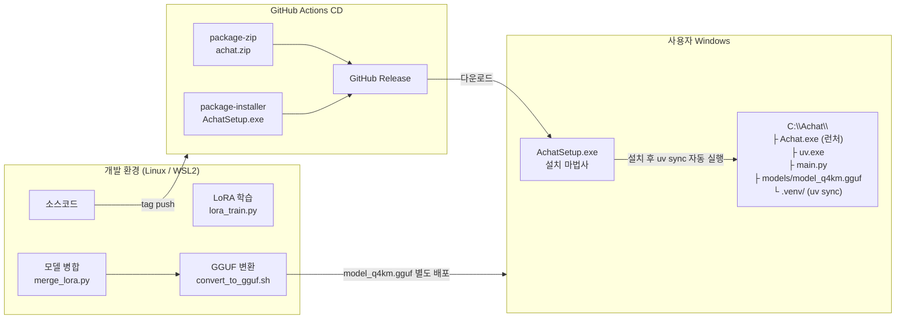

# Achat 아키텍처 구조도

> Mermaid 렌더링: GitHub / [Mermaid Live Editor](https://mermaid.live) / VS Code Mermaid Preview

---

## 전체 레이어 구조

```mermaid
graph TB
    subgraph UI["① UI 레이어 — PySide6 / QML"]
        direction LR
        MAIN["main.qml\n플로팅 윈도우"]
        PIP["PipWindow.qml\nPIP 마스코트"]
        SETS["SettingsPanel.qml\n설정 패널"]
        CSEL["CharacterSelectPanel.qml\n캐릭터 선택"]
        CSTA["CharacterStatusPanel.qml\n상태 표시"]
        CUST["CustomizationPanel.qml\n커스터마이징"]
        BUBBLE["ChatBubble.qml\n말풍선"]
        RESET["ResetConfirmPanel.qml\n초기화 확인"]
    end

    subgraph BRIDGE["② 브리지 레이어 — ui_ux/bridge.py"]
        CB["ChatBridge : QObject\nSignals ↔ Slots (QML ↔ Python)"]
        WORKER["LLMWorker : QThread\n비동기 추론 실행"]
        TRAY["AppTrayIcon\n시스템 트레이"]
    end

    subgraph APP["③ 애플리케이션 레이어"]
        AG["Agent\n통합 조율자\nagent/core.py"]
        SM["SessionManager\n세션 CRUD\nconversation/session_manager.py"]
        LOADER["Loaders\ncharacter_load / world_load / memory_load"]
    end

    subgraph CONV["④ 대화 엔진 — conversation/core/"]
        RT["ConversationRouter\nhandle_turn()"]
        PB["PromptBuilder\nassemble() → Layer A~F"]
        LC["LLMClient\ngenerate()"]
        SESS["ConversationSession\n상태 (mood / affection / turn_count)"]
        STATE["state.py\nupdate_mood / update_affection\ncheck_trigger_events"]
        NM["NarrationMonitor\n키워드 트리거"]
    end

    subgraph MEM["⑤ 메모리 시스템 — memory/"]
        ST["ShortTerm\n슬라이딩 윈도우 최근 5턴\nLayer D 입력"]
        SC["SessionContext\nevict_to_context()\n세션 내 전체 누적 텍스트\nLayer E 입력"]
        SUM["Summarizer\nN턴 → LLM 요약\n키워드 중요도 scoring"]
        LT["LongTerm\nChromaDB query / store\nbge-m3 임베딩\nLayer C 입력"]
    end

    subgraph RAG["⑥ RAG 시스템 — rag/"]
        IDX["Indexer\nsources/*.md → ChromaDB\n앱 시작 시 1회 실행"]
        RET["WorldRetriever\n매 턴 시맨틱 검색\nLayer B 입력"]
        WN["WorldNav\n장소 이동 감지\nLLM 동적 장소 생성"]
    end

    subgraph TOOLS["⑦ 기능 모드 도구 — tools/"]
        FOLD["Folder Tools\nclassifier / converter / renamer"]
        SRCH["LocalSearch\nSQLite FTS5 인덱싱"]
        PCT["PromptConverter\n자연어 → 최적화 프롬프트"]
    end

    subgraph STORAGE["⑧ 저장소"]
        VDB[("ChromaDB\nchroma_deploy/\n─────────\n{char_id}_memory\nworld_knowledge")]
        YAML["YAML 파일\nCH_*.yaml 캐릭터\nWorld_*.yaml 세계관"]
        JSON["JSON / JSONL\nsession_state.json\npreferences.json"]
        GGUF[("GGUF 모델\nmodel_q4km.gguf\nQ4_K_M · ~2GB")]
    end

    %% UI ↔ Bridge
    MAIN & PIP & SETS & CSEL & CSTA & CUST & RESET -->|Signal / Slot| CB
    CB --> WORKER
    CB --> TRAY

    %% Bridge ↔ App
    WORKER -->|chat()| AG
    CB -->|session CRUD| SM

    %% App → Conv
    AG --> RT
    AG --> LOADER
    SM --> JSON

    %% Conv 내부
    RT --> SESS
    RT --> STATE
    RT --> NM
    RT --> PB
    PB --> LC
    LC -->|ChatML 추론| GGUF

    %% Memory 흐름
    RT -->|get_recent()| ST
    RT -->|evict_to_context()| SC
    RT -->|check_trigger()| SUM
    SUM -->|score ≥ 0.65 → store()| LT
    ST --> PB
    SC --> PB
    LT --> PB
    LT <-->|upsert / query| VDB

    %% RAG 흐름
    RT -->|query()| RET
    RET <-->|cosine search| VDB
    RT -->|detect_move_intent()| WN
    WN -->|add_document()| VDB
    IDX -->|index_world()| VDB
    RET --> PB

    %% Loader
    LOADER -->|CH_*.yaml| YAML
    LOADER -->|World_*.yaml| YAML

    %% Tools
    AG -->|mode=function| FOLD & SRCH & PCT

    %% Style
    classDef layer fill:#1a1a2e,stroke:#4a4a8a,color:#e0e0ff
    classDef storage fill:#0d2137,stroke:#1e5799,color:#7ec8e3
    classDef llm fill:#1a0d37,stroke:#6b1e99,color:#d8b4fe
    class UI,BRIDGE,APP,CONV,MEM,RAG,TOOLS layer
    class STORAGE storage
    class GGUF llm
```

---

## 컴포넌트 목록

### UI 레이어

| 파일 | 역할 |
|---|---|
| `ui_ux/qml/main.qml` | 플로팅 윈도우 메인. 드래그·테마·메시지 리스트 |
| `ui_ux/qml/ChatBubble.qml` | 말풍선 컴포넌트 (user / assistant / narrator 분기) |
| `ui_ux/qml/PipWindow.qml` | 50×50 PIP 마스코트 모드 |
| `ui_ux/qml/SettingsPanel.qml` | 캐릭터·세계관·act·테마 설정 슬라이드인 패널 |
| `ui_ux/qml/CharacterSelectPanel.qml` | 캐릭터 변경 모달 |
| `ui_ux/qml/CharacterStatusPanel.qml` | 친밀도·tier·감정 상태 표시 모달 |
| `ui_ux/qml/CustomizationPanel.qml` | 파츠 6종 커스터마이징 패널 |
| `ui_ux/qml/ResetConfirmPanel.qml` | 세션 초기화 확인 모달 |
| `ui_ux/qml/CharacterDisplay.qml` | 캐릭터 이미지 레이어 합성 + 감정 오버레이 |

### 브리지 레이어

| 파일 | 역할 |
|---|---|
| `ui_ux/bridge.py` | `ChatBridge(QObject)` — QML context property `bridge`. Signal/Slot 전체 정의 |
| `ui_ux/chat_panel.py` | `LLMWorker(QThread)` — `agent.chat()` 비동기 실행 |
| `ui_ux/widget.py` | `UIEngine` — `QQmlApplicationEngine` 래퍼 |
| `ui_ux/tray.py` | `AppTrayIcon` — 시스템 트레이 메뉴 |

### 애플리케이션 레이어

| 파일 | 역할 |
|---|---|
| `main.py` | 진입점. torch 선로드, PID 정리, Qt 지연 import |
| `config.py` | `get_config()` — dev / deploy 환경별 설정 dict |
| `agent/core.py` | `Agent` — 전체 컴포넌트 초기화 + `chat()` 진입점 |
| `agent/persona.py` | `swap_persona()` — 캐릭터 핫스왑 |
| `agent/state.py` | `update_mood()` / `update_affection()` / `check_trigger_events()` |
| `conversation/session_manager.py` | 세션 생성·전환·삭제·인덱스 관리 |
| `conversation/loader/character_load.py` | `CH_*.yaml` 파싱 + 필수 필드 검증 |
| `conversation/loader/world_load.py` | `World_*.yaml` 파싱 + act 조회 |

### 대화 엔진

| 파일 | 역할 |
|---|---|
| `conversation/core/router.py` | `handle_turn()` — 한 턴 전체 흐름 조율 (0~9단계) |
| `conversation/core/prompt_build.py` | `PromptBuilder.assemble()` — Layer A~F 조립 |
| `conversation/core/llm_client.py` | `LLMClient.generate()` — llama.cpp / transformers 분기 |
| `conversation/core/session.py` | `ConversationSession` dataclass |
| `conversation/narration_hardcoded.py` | 하드코딩 나레이션 텍스트 |
| `conversation/narration_monitor.py` | `NarrationMonitor` — 키워드 트리거 |

### 메모리 시스템

| 파일 | 역할 |
|---|---|
| `memory/short_term.py` | `get_recent()` — 최근 5턴 슬라이딩 윈도우 |
| `memory/short_term.py` | `evict_to_context()` — 초과 턴을 session_context로 이동 |
| `memory/summarizer.py` | `check_trigger()` / `summarize()` / `score_importance()` |
| `memory/long_term.py` | `LongTermMemory.store()` / `query()` — ChromaDB bge-m3 |
| `memory/embedding.py` | `SentenceTransformer("BAAI/bge-m3")` 래퍼 |

### RAG 시스템

| 파일 | 역할 |
|---|---|
| `rag/index.py` | `index_world()` — `Seaside.md` 청킹 → `world_knowledge` 컬렉션 |
| `rag/retrieve.py` | `WorldRetriever.query()` — 매 턴 cosine 검색 |
| `rag/world_nav.py` | `detect_move_intent()` / `find_or_create_location()` — 동적 장소 생성 |
| `rag/sources/world/Seaside.md` | 세계관 원본 문서 (장소·문화·스토리 통합) |

### 저장소

| 경로 | 종류 | 내용 |
|---|---|---|
| `chroma_deploy/` | ChromaDB | `{char_id}_memory` (에피소딕) + `world_knowledge` (영구 지식) |
| `conversation/character/CH_*.yaml` | YAML | 캐릭터 정의 (speech_style / rules / affection / state) |
| `conversation/world/World_*.yaml` | YAML | 세계관 + act 시나리오 |
| `data/sessions/{char_id}/session_state.json` | JSON | 세션 상태 스냅샷 |
| `ui_ux/assets/preferences.json` | JSON | 테마 등 UI 환경설정 |
| `models/model_q4km.gguf` | GGUF | Qwen2.5-3B LoRA v11 병합 Q4_K_M |

---

## Context Assembly Layer 구조

프롬프트는 6개 Layer를 순서대로 조립해 `messages: list[dict]`로 구성된다.

```
┌─ Layer A (System) ─────────────────────────── ~300 tok ─┐
│  캐릭터 페르소나 (speech_style + rules)                    │
│  친밀도 tier 지시문 + 최근 수행 기능 작업 요약 (Layer F)   │
└────────────────────────────────────────────────────────┘
┌─ Layer B (World) ────────────────────────────~ 200 tok ─┐
│  현재 act 묘사 + RAG 세계관 검색 결과                      │
└────────────────────────────────────────────────────────┘
┌─ Layer C (Long-term Memory) ─────────────── ~150 tok ─┐
│  VDB 유사 기억 top-2 (캐릭터 관점 재서술)                  │
└────────────────────────────────────────────────────────┘
┌─ Layer E (Session Context) ──────────────── ~200 tok ─┐
│  session_context (evict된 누적 텍스트) + character_notes  │
└────────────────────────────────────────────────────────┘
┌─ Layer D (Short-term Dialogue) ──────────── ~450 tok ─┐
│  최근 5턴 대화 이력 (예산 초과 시 5→3→2턴 자동 축소)       │
└────────────────────────────────────────────────────────┘
┌─ Layer E-User ──────────────────────────────────────────┐
│  {"role": "user", "content": user_input}                │
└────────────────────────────────────────────────────────┘
```

---

## 배포 구조


