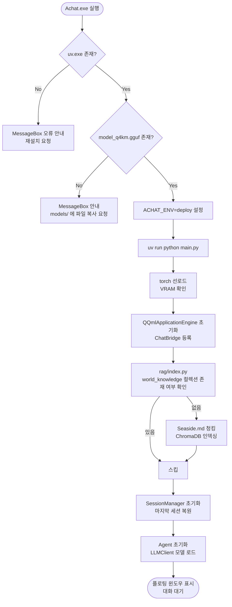
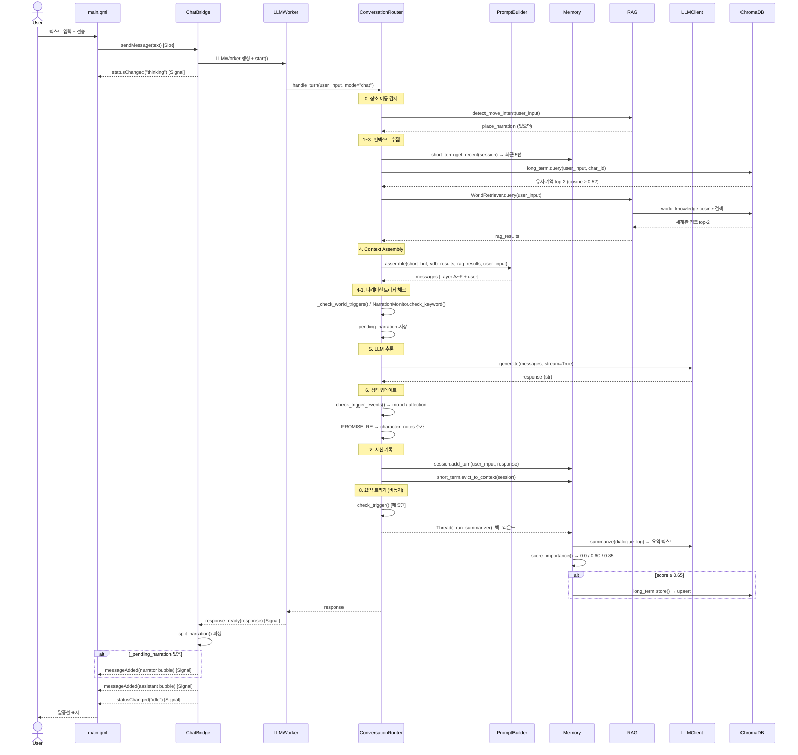
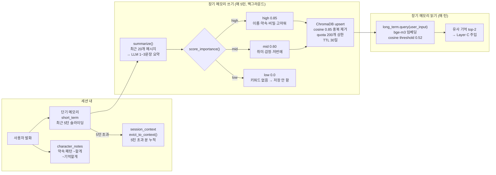
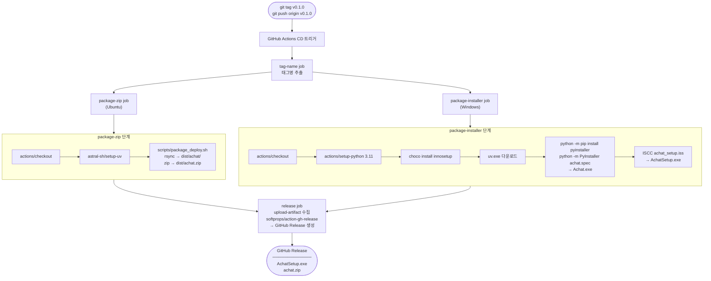

# Achat 서비스 플로우 차트

> Mermaid 렌더링: GitHub / [Mermaid Live Editor](https://mermaid.live) / VS Code Mermaid Preview

---

## 1. 앱 시작 플로우



---

## 2. 대화 한 턴 (Chat Mode) 시퀀스



---

## 3. 기능 모드 플로우

```mermaid
flowchart TD
    A([사용자 기능 모드 입력]) --> B[Agent.handle_input\nmode=function]
    B --> C[도구 선택\nselect_tool]

    C --> D{도구 종류}
    D -->|폴더 정리| E[FolderClassifier\n자연어 → JSON 파싱\nLLM 호출]
    D -->|확장자 변환| F[FolderConverter\n이미지·문서 포맷 변환\nPillow / ffmpeg]
    D -->|이름 변경| G[FolderRenamer\n패턴 규칙 적용]
    D -->|프롬프트 변환| H[PromptConverter\n기능 전용 시스템 프롬프트\nLLM 호출]
    D -->|로컬 검색| I[LocalSearch\nSQLite FTS5 인덱싱 + MATCH]

    E --> J[tool.execute(params)\nrule-based 실행]
    F --> J
    G --> J
    H --> J
    I --> J

    J --> K[작업 결과 텍스트 반환]
    K --> L[Router.handle_turn\nrecent_ops 주입\nmode=chat 1턴]
    L --> M([캐릭터가 수행 내용 자연어로 안내])
```

---

## 4. 메모리 파이프라인 플로우



---

## 5. 세션 관리 플로우

```mermaid
flowchart TD
    A([앱 시작]) --> B[SessionManager.get_active()]
    B --> C{마지막 세션 있음?}
    C -- Yes --> D[_restore_session_from_state()\nセッションstate 복원\ndialogue 로드]
    C -- No --> E[new_session(char_id)\n새 세션 생성]

    D --> F([대화 시작])
    E --> F

    F --> G{UI 조작}
    G -->|캐릭터 변경| H[switchSession(new_char_id)\n또는 newSession()]
    G -->|현재 대화 초기화| I[resetSession()\ndialogue_log 삭제\nVDB 장기기억 유지]
    G -->|세션 삭제| J[delete_session()\nVDB 에피소딕 삭제 가능]
    G -->|앱 종료| K[_sync_session_state()\nsession_state.json 스냅샷 저장]

    H --> L[swap_persona()\n캐릭터 YAML 재로드\nAgent 재초기화]
    L --> F
    I --> F
```

---

## 6. CD 배포 파이프라인 플로우


